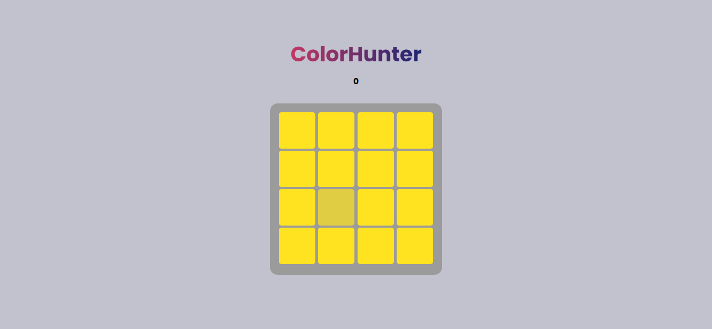

# 🎨 ColorHunter


  

**ColorHunter** is a fun and simple game that challenges your ability to spot slightly different colors! 💥  

---

## 🕹️ How to Play

1. Click the **Start** button.  
2. A grid of squares will appear, **one of them has a slightly different color**.  
3. Find the different square and click it.  
4. If you choose correctly, your **score increases**.  
5. Keep playing until the game ends or you reach the desired number of rounds.

---

## ⚡ Features

- **Responsive design** for mobile and desktop 📱💻  
- Built with **pure HTML, CSS, and JavaScript**  
- Smooth **animations** for color changes and buttons  
- **Simple scoring system**  
- Easy to **add more colors and difficulty levels**

---

## 🛠️ Installation & Running

1. Clone or download the repository:

```bash
git clone https://github.com/itz-vold/ColorHunter-Game
